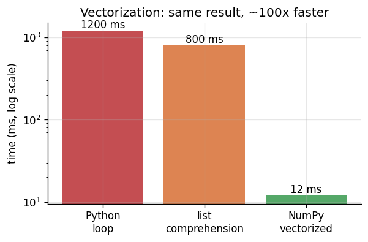

# 📝 Detailed Notes — Python for Data Science

> Study notes distilled from the best free resources (see [Sources](#-sources-parsed)).
> Read top-to-bottom, or jump to a section. Pair with the runnable
> [`example.py`](./example.py).

---

## 🎯 Easiest explanation (ELI5)

**Imagine a giant spreadsheet.** Python for data science is just a very fast,
programmable way to clean, slice, combine, and summarize that spreadsheet —
without doing it by hand.

- **NumPy** = a calculator for whole *columns of numbers at once* (instead of
  one cell at a time).
- **pandas** = the spreadsheet itself in code: rows, columns, filters, pivot
  tables, all scriptable and repeatable.

**Analogy:** A Python loop is like paying 1,000 cashiers to each scan one item.
**Vectorization** (NumPy) is like one super-scanner that scans all 1,000 items in
a single pass. Same result, a fraction of the time.



---

## 🌍 Real-world examples

| Scenario | What Python does |
|---|---|
| A bank has 10M transactions in CSVs | pandas loads, cleans, and flags suspicious ones |
| An e-commerce team wants weekly revenue by region | `groupby` + aggregation in 3 lines |
| A dataset is 50GB and won't fit in memory | Polars (lazy) or PySpark streams it in chunks |
| A model needs 40 engineered features | pure functions transform raw columns → features |

---

## 🧩 Core concepts (with code)

### 1. NumPy — vectorized arrays
The whole point: do math on entire arrays in C-speed, never element-by-element.

```python
import numpy as np
prices = np.array([100., 250., 75., 500.])
# Broadcasting: a scalar applies to every element
with_tax = prices * 1.2
# Conditional logic, vectorized (no loop)
discount = np.where(prices > 200, 0.10, 0.05)
final = prices * (1 - discount)        # [95.  225.  71.25  450.]
```

**Key ideas:** `ndarray`, **broadcasting** (auto-aligning shapes), **vectorization**
(array ops > loops), boolean masking (`arr[arr > 0]`), axis-based aggregation
(`arr.mean(axis=0)`).

### 2. pandas — the daily five
95% of data wrangling is five operations:

```python
import pandas as pd
df = pd.read_csv("orders.csv")

(df[df.amount > 50]                    # 1. FILTER rows
   .merge(customers, on="cust_id")     # 2. JOIN tables
   .groupby("region", as_index=False)  # 3. GROUP
   .agg(rev=("amount", "sum"),         # 4. AGGREGATE
        n=("order_id", "count"))
   .sort_values("rev", ascending=False))  # 5. SORT
```

**Must-know:** `loc`/`iloc` (label vs position indexing), `apply` (use sparingly —
prefer vectorized ops), `pivot`/`melt` (reshape wide↔long), `merge` (joins),
handling missing data (`fillna`, `dropna`), `dtypes` (use `category` for memory).

### 3. Polars — the modern fast alternative
Multi-threaded, lazy, Arrow-backed. Same ideas, much faster on medium/large data.

```python
import polars as pl
(pl.scan_csv("big.csv")                # lazy — nothing runs yet
   .filter(pl.col("amount") > 50)
   .group_by("region")
   .agg(pl.col("amount").sum())
   .collect())                          # NOW it executes, optimized
```

### 4. Clean, reproducible code
- Virtual environments (`uv`/`venv`) + pinned dependencies.
- Pure functions for feature logic (easy to test).
- Type hints + `ruff` for linting. (See `data-science-training/modules/01`.)

---

## ⚠️ Common pitfalls & interview gotchas

- **`SettingWithCopyWarning`** — modifying a slice. Use `.loc[mask, col] = ...`.
- **Chained indexing** (`df[mask]["col"] = x`) silently fails — use `.loc`.
- **`apply` everywhere** — it's a hidden Python loop; vectorize instead.
- **Mutable default arguments** in functions (`def f(x=[])`) — classic Python trap.
- **Float equality** (`0.1 + 0.2 == 0.3` is `False`) — use `np.isclose`.
- **Memory blowups** — object dtypes and giant joins; downcast and chunk.

---

## 🗺️ How it connects
Python is the substrate for **everything** else in this library — SQL pulls the
data, pandas/Polars shape it, and ML/DL/GenAI consume it.

---

## 📚 Sources parsed

- **Krish Naik — Python for DS playlist** (English): https://www.youtube.com/playlist?list=PLZoTAELRMXVNUL99R4bDlVYsncUNvwUBB · channel: https://www.youtube.com/@krishnaik06
- **Python Data Science Handbook** — Jake VanderPlas (free): https://jakevdp.github.io/PythonDataScienceHandbook/
- **pandas docs**: https://pandas.pydata.org/docs/ · **NumPy docs**: https://numpy.org/doc/ · **Polars**: https://docs.pola.rs/
- **Kaggle Learn — pandas**: https://www.kaggle.com/learn/pandas

> *Notes are paraphrased syntheses written for this guide; refer to the linked
> originals for authoritative detail. Content was rephrased for compliance with
> licensing restrictions.*
