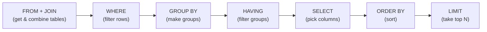

# 📝 Detailed Notes — SQL & Databases

> Study notes distilled from the best free resources (see [Sources](#-sources-parsed)).
> Pair with the runnable reference queries in [`queries.sql`](./queries.sql).

---

## 🎯 Easiest explanation (ELI5)

SQL is **how you ask a database questions in plain, structured English-ish.**

A database is a set of tables (like spreadsheet tabs). SQL lets you say:
*"Give me the total sales per region, only for completed orders, sorted highest
first."* — and the database figures out the fastest way to get it.

**Analogy:** A database is a giant, well-organized **library**. SQL is the
**request slip** you hand the librarian: which shelves (tables), which books
(rows), which pages (columns), in what order. A good slip (query) gets your
answer in seconds; a vague one makes the librarian read every book (full scan).

---

## 🌍 Real-world examples

| Business question | SQL feature |
|---|---|
| "Top 3 products per category" | Window function (`ROW_NUMBER`/`RANK`) |
| "Month-over-month revenue growth" | `LAG()` window function |
| "% of signups still active after 3 months" | Cohort analysis with CTEs |
| "Customers who ordered but never returned" | `LEFT JOIN ... WHERE x IS NULL` |

---

## 📊 Visual — how a query executes (logical order)



> 🔑 You *write* `SELECT` first, but the database *runs* `FROM`/`WHERE` first.
> That's why you can't use a `SELECT` alias inside `WHERE` — it doesn't exist yet.

---

## 🧩 Core concepts (with code)

### 1. The basics
```sql
SELECT region, SUM(amount) AS revenue
FROM orders
WHERE status = 'completed'
GROUP BY region
HAVING SUM(amount) > 10000
ORDER BY revenue DESC
LIMIT 5;
```

### 2. Joins (and the #1 bug: fan-out)
- **INNER** (matches only), **LEFT** (all left + matches), **RIGHT**, **FULL**.
- **Fan-out:** joining to a table with multiple matches *multiplies* rows and
  silently inflates `SUM`. Always check row counts after a join.

### 3. Window functions (the senior skill)
Compute across a "window" of rows **without collapsing** them:
```sql
SELECT customer_id, order_id, amount,
       ROW_NUMBER() OVER (PARTITION BY customer_id ORDER BY amount DESC) AS rnk,
       SUM(amount)  OVER (PARTITION BY customer_id) AS customer_total
FROM orders;
```
`ROW_NUMBER`, `RANK`, `DENSE_RANK`, `LAG`/`LEAD`, running totals, moving averages.

### 4. CTEs (`WITH`) for readable, composable queries
```sql
WITH monthly AS (
    SELECT DATE_TRUNC('month', order_date) AS m, SUM(amount) AS rev
    FROM orders GROUP BY 1
)
SELECT m, rev, rev - LAG(rev) OVER (ORDER BY m) AS mom_change FROM monthly;
```

### 5. Performance
- **Indexes** make lookups fast (like a book's index). No index → full scan.
- Read the **query plan** (`EXPLAIN`). Avoid `SELECT *` on wide tables.
- Filter early; beware functions on indexed columns (kills index use).

---

## ⚠️ Common pitfalls & interview gotchas

- **`NULL` logic** — `NULL = NULL` is `NULL` (not true); use `IS NULL`. `COUNT(col)`
  ignores NULLs but `COUNT(*)` doesn't.
- **`WHERE` vs `HAVING`** — `WHERE` filters rows (before grouping), `HAVING`
  filters groups (after).
- **Join fan-out** inflating aggregates — the silent data bug.
- **`SELECT alias` in `WHERE`** — not allowed (execution order).
- **`COUNT(DISTINCT)` cost** on huge tables — know approximate alternatives.

---

## 🗺️ How it connects
SQL pulls and shapes the raw data that feeds **pandas** (topic 01), **feature
pipelines**, and **data engineering** (topic 10, via dbt/warehouses).

---

## 📚 Sources parsed

- **Krish Naik — Complete SQL playlist** (English): https://www.youtube.com/playlist?list=PLZoTAELRMXVNMRWlVf0bDDSxNEn38u9Cl
- **Mode SQL Tutorial** (free, excellent): https://mode.com/sql-tutorial/
- **DataLemur** (DS SQL interview practice): https://datalemur.com/
- **Use The Index, Luke** (indexing/performance): https://use-the-index-luke.com/
- **SQLZoo** (interactive): https://sqlzoo.net/ · **DuckDB** (run SQL locally): https://duckdb.org/

> *Notes are paraphrased syntheses written for this guide; refer to the linked
> originals for authoritative detail. Content was rephrased for compliance with
> licensing restrictions.*
