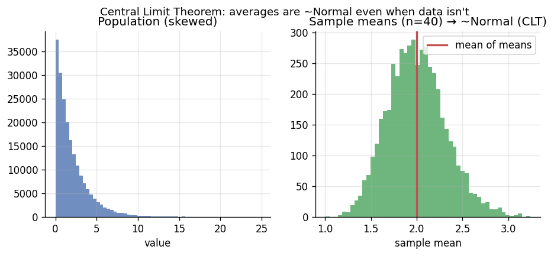
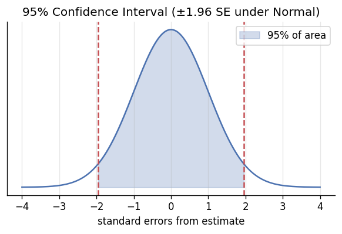

# 📝 Detailed Notes — Statistics & Probability

> Study notes distilled from the best free resources (see [Sources](#-sources-parsed)).
> Pair with the runnable [`example.py`](./example.py).

---

## 🎯 Easiest explanation (ELI5)

Statistics is **making confident decisions from incomplete information.**

You can't ask *every* customer if they like a new button — so you ask a *sample*
and reason about the whole. Statistics tells you **how much to trust** that
sample, and **how likely** the pattern you saw is real vs. random luck.

- **Probability** = forward: "given a fair coin, what outcomes are likely?"
- **Statistics** = backward: "given these outcomes, is the coin fair?"

**Analogy:** Tasting a pot of soup. You stir and taste **one spoon** (sample) to
judge the **whole pot** (population). The stir = random sampling. Statistics is
the science of how confident that one spoonful lets you be.

---

## 🌍 Real-world examples

| Question | Statistical tool |
|---|---|
| "Did the new checkout increase conversion, or is it noise?" | Hypothesis test + confidence interval |
| "How many users must we test to detect a 2% lift?" | Power analysis |
| "Is this $9,000 transaction abnormal for this user?" | Distributions / z-scores |
| "What's our true average delivery time, ± how much?" | Confidence interval / bootstrap |

---

## 📊 Visual — the Central Limit Theorem (why averages are trustworthy)

Even when raw data is wildly skewed, the **average of a sample** follows a bell
curve. This is *why* confidence intervals and t-tests work on real, messy data.



A **95% confidence interval** is roughly the estimate ± 1.96 standard errors:



---

## 🧩 Core concepts (with code)

### 1. Descriptive vs inferential
- **Descriptive:** summarize what you have (mean, median, std, percentiles).
- **Inferential:** generalize to a population you can't fully measure.

### 2. Distributions to know
Normal (heights, errors), Binomial (clicks/conversions), Poisson (events/time),
Exponential (wait times), Uniform. Knowing the distribution lets you compute
probabilities and pick the right test.

### 3. Sampling, standard error & the CLT
- **Standard error (SE)** shrinks like `1/√n` → 4× the data halves uncertainty.
- **CLT:** sample means are ~Normal for large enough n, regardless of the
  population shape.

### 4. Confidence intervals & the bootstrap
A 95% CI: *"if we repeated this many times, ~95% of such intervals would contain
the true value."* When formulas are hard, **bootstrap**:

```python
import numpy as np
rng = np.random.default_rng(0)
sample = rng.exponential(5, 200)
boot = [rng.choice(sample, len(sample), replace=True).mean() for _ in range(10_000)]
lo, hi = np.percentile(boot, [2.5, 97.5])      # 95% CI, no formula needed
```

### 5. Hypothesis testing (the careful part)
- **Null (H₀):** "no effect." **Alternative (H₁):** "there is an effect."
- **p-value:** P(data this extreme | H₀ true). **NOT** P(H₀ true).
- **α (0.05):** false-positive rate you accept. **Power (1−β):** chance of
  catching a real effect.

```python
from scipy import stats
t, p = stats.ttest_ind(treatment, control)   # is the difference real?
```

### 6. Bayesian view (intuitive for stakeholders)
Combine prior belief + data → posterior. A **credible interval** *does* mean
"95% probability the value is in here" (unlike a frequentist CI).

---

## ⚠️ Common pitfalls & interview gotchas

- **p-value ≠ probability the hypothesis is true.** Classic interview trap.
- **Statistical vs practical significance** — with huge n, trivial effects become
  "significant." Always report effect size + CI.
- **Multiple comparisons** — test 20 metrics at α=0.05 → ~1 false positive
  expected. Correct (Bonferroni / Benjamini-Hochberg).
- **Peeking** — checking a test repeatedly and stopping at significance inflates
  false positives massively (see `data-science-training/hands-on/lab03`).
- **Correlation ≠ causation** — confounders; you need experiments or causal methods.
- **Simpson's paradox** — a trend can reverse within subgroups.

---

## 🗺️ How it connects
Statistics underpins **experimentation/A-B testing** (the business decision
layer) and every **ML metric** (which is just an estimate with uncertainty).

---

## 📚 Sources parsed

- **Krish Naik — Statistics one-shot**: https://www.youtube.com/watch?v=LZzq1zSL1bs · **detailed playlist**: https://www.youtube.com/playlist?list=PLZoTAELRMXVMhVyr3Ri9IQ-t5QPBtxzJO
- **StatQuest (Josh Starmer)** — intuitive stats: https://www.youtube.com/@statquest
- **Seeing Theory** (visual probability): https://seeing-theory.brown.edu/
- **Think Stats / Think Bayes** — Allen Downey (free): https://greenteapress.com/wp/
- **Khan Academy — Statistics & Probability** (free).

> *Notes are paraphrased syntheses written for this guide; refer to the linked
> originals for authoritative detail. Content was rephrased for compliance with
> licensing restrictions.*
