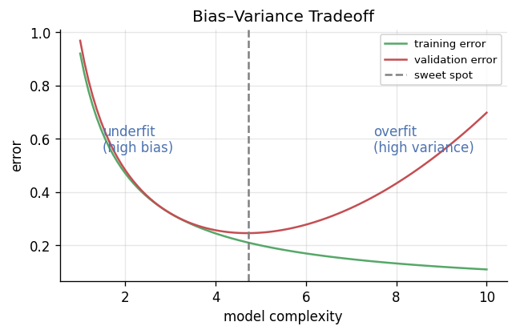
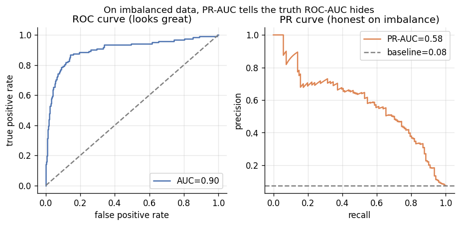
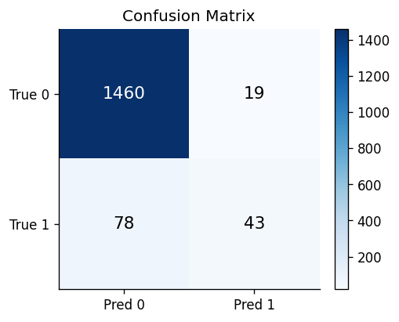
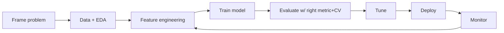

# 📝 Detailed Notes — Machine Learning

> Study notes distilled from the best free resources (see [Sources](#-sources-parsed)).
> Pair with the runnable [`example.py`](./example.py).

---

## 🎯 Easiest explanation (ELI5)

Machine learning is **learning rules from examples instead of being told the
rules.**

Traditional code: *you* write the rule (`if income > 50k and age > 25: approve`).
ML: you show the computer thousands of past approvals/rejections, and it
**figures out the rule itself** — then applies it to new applicants.

**Analogy:** Teaching a child "dog" vs "cat." You don't list rules ("four legs,
whiskers…"); you point at many animals and say the name. After enough examples,
the child generalizes to animals they've never seen. ML learns the same way —
and **generalization to new data is the whole game.**

---

## 🌍 Real-world examples

| Problem | Type | Typical model |
|---|---|---|
| Will this customer churn? | Classification | Gradient boosting |
| What will sales be next month? | Regression | Boosting / linear |
| Group similar customers | Clustering (unsupervised) | k-means |
| Which products go together? | Association / recommendation | matrix factorization |
| Is this transaction fraud? | Classification (imbalanced) | boosting + PR-AUC |

---

## 📊 Visuals

**Bias–Variance** — the central tradeoff. Too simple = underfit; too complex =
overfit. The art is finding the sweet spot that **generalizes**.



**ROC vs PR on imbalanced data** — ROC-AUC can look great while the model is
useless. PR-AUC tells the truth when positives are rare.



**Confusion matrix** — the basis of precision, recall, and every classification
metric.



---

## 🧩 Core concepts (with code)

### 1. The ML workflow


### 2. Learning types
- **Supervised:** labeled data → regression (numbers) / classification (categories).
- **Unsupervised:** no labels → clustering, dimensionality reduction (PCA).
- **Reinforcement:** learn by reward/penalty (robotics, game AI).

### 3. Key algorithms (and when)
- **Linear/Logistic regression** — fast, interpretable baselines.
- **Decision trees → Random Forests** — nonlinear, robust.
- **Gradient boosting (XGBoost/LightGBM/CatBoost)** — **king of tabular data.**
- **k-NN, SVM** — classic; **k-means, PCA** — unsupervised.

### 4. Validation done right (avoid leakage!)
```python
from sklearn.pipeline import Pipeline
from sklearn.model_selection import StratifiedKFold, cross_val_score
# ALL preprocessing INSIDE the pipeline -> fit only on train folds -> no leakage
pipe = Pipeline([("scale", StandardScaler()), ("clf", model)])
cv = StratifiedKFold(5, shuffle=True, random_state=0)
score = cross_val_score(pipe, X, y, cv=cv, scoring="average_precision").mean()
```
Match the CV scheme to deployment: time-series → `TimeSeriesSplit`; grouped
entities → `GroupKFold`.

### 5. Metrics (pick what the business cares about)
- **Classification:** precision, recall, F1, ROC-AUC vs **PR-AUC** (imbalance),
  log loss, **calibration**.
- **Regression:** MAE (robust), RMSE (punishes big errors), MAPE (breaks near 0).
- Tie to a **cost model**: what does a false positive vs false negative cost?

### 6. Bias-variance, regularization, tuning
- **Underfit** = high bias; **overfit** = high variance. Regularize (L1/L2,
  dropout, early stopping). Tune with **Optuna** (smarter than grid search).

---

## ⚠️ Common pitfalls & interview gotchas

- **Data leakage** — #1 silent killer. Fit transforms inside the pipeline; never
  use future/target info. (See `data-science-training/hands-on/lab01`.)
- **Accuracy on imbalanced data** — 99% "accuracy" predicting all-negative is
  useless. Use PR-AUC + the right threshold.
- **Default 0.5 threshold** — almost never optimal; pick from the cost tradeoff.
- **Tuning on the test set** — optimistic bias. Keep a final untouched holdout.
- **No baseline** — always beat a dumb baseline first.
- **Target encoding without out-of-fold** — leaks the label.

---

## 🗺️ How it connects
ML sits on **stats** (topic 03) and **Python** (01), feeds **deep learning** (05)
for unstructured data, and must be **deployed + monitored** (MLOps, topic 09).

---

## 📚 Sources parsed

- **Krish Naik — ML playlist**: https://www.youtube.com/playlist?list=PLZoTAELRMXVPBTrWtJkn3wWQxZkmTXGwe · **ML one-shot**: https://www.youtube.com/watch?v=JxgmHe2NyeY · **Feature Engineering**: https://www.youtube.com/playlist?list=PLZoTAELRMXVPwYGE2PXD3x0bfKnR0cJjN
- **Andrew Ng — ML Specialization** (DeepLearning.AI/Stanford): https://www.coursera.org/specializations/machine-learning-introduction
- **StatQuest** (algorithms explained): https://www.youtube.com/@statquest
- **ISLP — Intro to Statistical Learning (Python, free)**: https://www.statlearning.com/
- **Google — Rules of ML**: https://developers.google.com/machine-learning/guides/rules-of-ml
- **scikit-learn User Guide**: https://scikit-learn.org/stable/user_guide.html

> *Notes are paraphrased syntheses written for this guide; refer to the linked
> originals for authoritative detail. Content was rephrased for compliance with
> licensing restrictions.*
