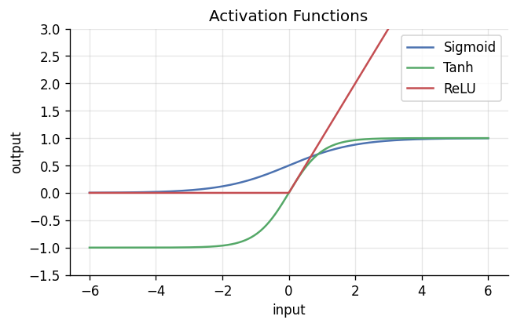
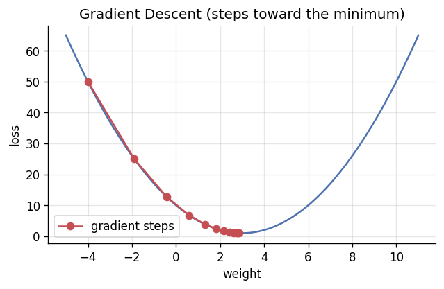
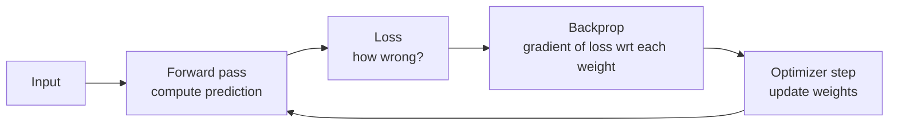

# 📝 Detailed Notes — Deep Learning

> Study notes distilled from the best free resources (see [Sources](#-sources-parsed)).
> Pair with the (torch) [`example.py`](./example.py).

---

## 🎯 Easiest explanation (ELI5)

Deep learning stacks many simple "neurons" into layers that **learn features
automatically** from raw data (pixels, text, sound) — no hand-crafted rules.

**Analogy:** Recognizing a face. Early layers learn **edges**, next layers
combine edges into **eyes and noses**, deeper layers combine those into **faces**.
Nobody programmed "an eye is two curves" — the network discovered that hierarchy
from examples. Each layer builds on the one below.

**How it learns:** make a guess → measure the error (loss) → nudge every weight
a tiny bit in the direction that reduces error (**gradient descent**) → repeat
millions of times.

---

## 🌍 Real-world examples

| Application | Architecture |
|---|---|
| Photo tagging, medical imaging | CNN |
| Translation, chatbots, LLMs | Transformer |
| Speech-to-text (Whisper) | Transformer / RNN |
| Recommendations at scale | Deep retrieval + ranking |
| Self-driving perception | CNN / Vision Transformer |

---

## 📊 Visuals

**Activation functions** add the non-linearity that lets networks learn complex
patterns (without them, a deep net collapses to a single linear layer).



**Gradient descent** — the learning loop: follow the slope downhill to the
minimum loss.



---

## 🧩 Core concepts (with code)

### 1. The neuron & forward pass
A neuron = weighted sum + bias → activation. Layers of neurons = a network.
```
output = activation(W · inputs + b)
```

### 2. Backpropagation (how it learns)

Backprop = the chain rule applied across the computation graph. The optimizer
(SGD, **Adam/AdamW**) uses those gradients to update weights.

### 3. A real training loop (PyTorch)
```python
for xb, yb in dataloader:
    opt.zero_grad()
    loss = loss_fn(model(xb), yb)   # forward + loss
    loss.backward()                 # backprop (gradients)
    opt.step()                      # update weights
```

### 4. Architectures
- **MLP** — fully connected; the baseline.
- **CNN** — convolutions exploit spatial structure (images).
- **RNN/LSTM** — sequences (largely superseded by transformers).
- **Transformer** — self-attention; powers all modern LLMs/GenAI.

### 5. Training mechanics & regularization
- **Loss:** cross-entropy (classification), MSE (regression).
- **LR** is the most important hyperparameter (warmup + decay).
- **Regularize:** dropout, weight decay, early stopping, data augmentation.
- **Normalize:** batch norm (CNNs) vs layer norm (transformers).

---

## ⚠️ Common pitfalls & interview gotchas

- **Can't overfit one batch** → you have a bug, not a modeling problem (Karpathy's
  first debugging step).
- **Vanishing/exploding gradients** — fixed by ReLU, good init, normalization,
  residual connections.
- **Forgetting to zero gradients** (`opt.zero_grad()`) — gradients accumulate.
- **Data leakage / wrong normalization** computed over the whole dataset.
- **Using DL on small tabular data** — gradient boosting usually wins; know when
  *not* to use DL.
- **Train/eval mode** — `model.eval()` disables dropout/batchnorm updates.

---

## 🗺️ How it connects
DL extends **ML** (topic 04) to unstructured data, and is the foundation of
**NLP** (06), **Computer Vision** (07), and **LLMs/GenAI** (11–14).

---

## 📚 Sources parsed

- **Krish Naik — Deep Learning & NLP playlist**: https://www.youtube.com/playlist?list=PLZoTAELRMXVPGU70ZGsckrMdr0FteeRUi
- **Andrej Karpathy — Neural Networks: Zero to Hero** (build it from scratch): https://github.com/karpathy/nn-zero-to-hero
- **3Blue1Brown — Neural Networks** (visual intuition): https://www.youtube.com/@3blue1brown
- **fast.ai — Practical Deep Learning**: https://course.fast.ai/
- **Dive into Deep Learning (d2l.ai)**: https://d2l.ai/
- **The Illustrated Transformer** — Jay Alammar: https://jalammar.github.io/illustrated-transformer/

> *Notes are paraphrased syntheses written for this guide; refer to the linked
> originals for authoritative detail. Content was rephrased for compliance with
> licensing restrictions.*
