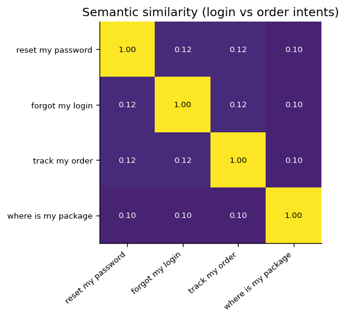
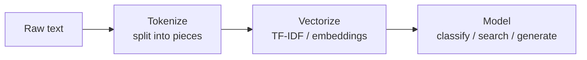

# 📝 Detailed Notes — Natural Language Processing (NLP)

> Study notes distilled from the best free resources (see [Sources](#-sources-parsed)).
> Pair with the runnable [`example.py`](./example.py).

---

## 🎯 Easiest explanation (ELI5)

Computers only understand numbers, not words. NLP is **turning language into
numbers** a model can work with — and turning numbers back into language.

**Analogy:** Imagine giving every word a **GPS coordinate** in "meaning space."
Words with similar meaning sit close together: *king* near *queen*, *Paris* near
*France*. Once words are coordinates (embeddings), "understanding language"
becomes geometry — and questions like "find similar sentences" become "find
nearby points."

---

## 🌍 Real-world examples

| Task | Example |
|---|---|
| Sentiment analysis | Flagging angry support tickets |
| Named entity recognition | Pulling names/dates/amounts from contracts |
| Semantic search | "forgot password" finds "reset credentials" |
| Summarization / translation | Condensing or converting documents |
| Classification / routing | Sending emails to the right team |

---

## 📊 Visual — meaning as geometry

Sentences about the *same intent* score high similarity; different intents score
low. This is the engine behind search and RAG.





---

## 🧩 Core concepts (with code)

### 1. Preprocessing
Tokenization, lowercasing, stop-word removal, stemming/lemmatization (classic);
modern models use **subword tokenization (BPE)** so they never hit unknown words.

### 2. Representations (the evolution)
- **Bag-of-Words / TF-IDF** — counts; weights rare-but-distinctive words. Strong,
  fast baseline.
- **Word embeddings (Word2Vec, GloVe)** — dense vectors; meaning = direction.
- **Contextual embeddings (BERT)** — same word, different vector by context
  ("bank" of a river vs money).

```python
from sklearn.feature_extraction.text import TfidfVectorizer
from sklearn.metrics.pairwise import cosine_similarity
v = TfidfVectorizer().fit_transform(["reset my password", "forgot my login"])
print(cosine_similarity(v)[0, 1])   # > 0 -> related intents
```

### 3. The transformer revolution
**Attention** lets a model weigh which words matter for each other.
- **BERT** (encoder) → understanding tasks (classification, NER).
- **GPT** (decoder) → generation. Modern NLP = mostly fine-tuning/prompting LLMs.

### 4. Modern workflow (Hugging Face)
```python
from transformers import pipeline
clf = pipeline("sentiment-analysis")
clf("late delivery but great support")   # context-aware label + score
```

### 5. Evaluation
Accuracy/F1 (classification), BLEU/ROUGE (generation), embedding similarity
(semantic). Always with a held-out set.

---

## ⚠️ Common pitfalls & interview gotchas

- **TF-IDF can't capture meaning** — "great" vs "excellent" look unrelated; that's
  why embeddings exist.
- **Class imbalance** in text classification — use F1/PR-AUC, not accuracy.
- **Data leakage via preprocessing** fit on the full corpus before splitting.
- **Ignoring a baseline** — TF-IDF + logistic regression often rivals a
  transformer at a fraction of the cost; make the transformer *earn* its place.
- **Tokenization mismatch** between training and inference.

---

## 🗺️ How it connects
NLP builds on **deep learning** (topic 05) and is the direct foundation of
**LLMs** (11), **RAG** (12, embeddings + retrieval), and **prompting** (13).

---

## 📚 Sources parsed

- **Krish Naik — NLP live playlist**: https://www.youtube.com/playlist?list=PLZoTAELRMXVNNrHSKv36Lr3_156yCo6Nn · **DL+NLP playlist**: https://www.youtube.com/playlist?list=PLZoTAELRMXVPGU70ZGsckrMdr0FteeRUi
- **Hugging Face — NLP Course** (free, the modern standard): https://huggingface.co/learn/nlp-course
- **Stanford CS224N** — NLP with Deep Learning (free lectures).
- **The Illustrated Word2Vec / BERT** — Jay Alammar: https://jalammar.github.io/
- **spaCy course** (industrial NLP): https://course.spacy.io/

> *Notes are paraphrased syntheses written for this guide; refer to the linked
> originals for authoritative detail. Content was rephrased for compliance with
> licensing restrictions.*
