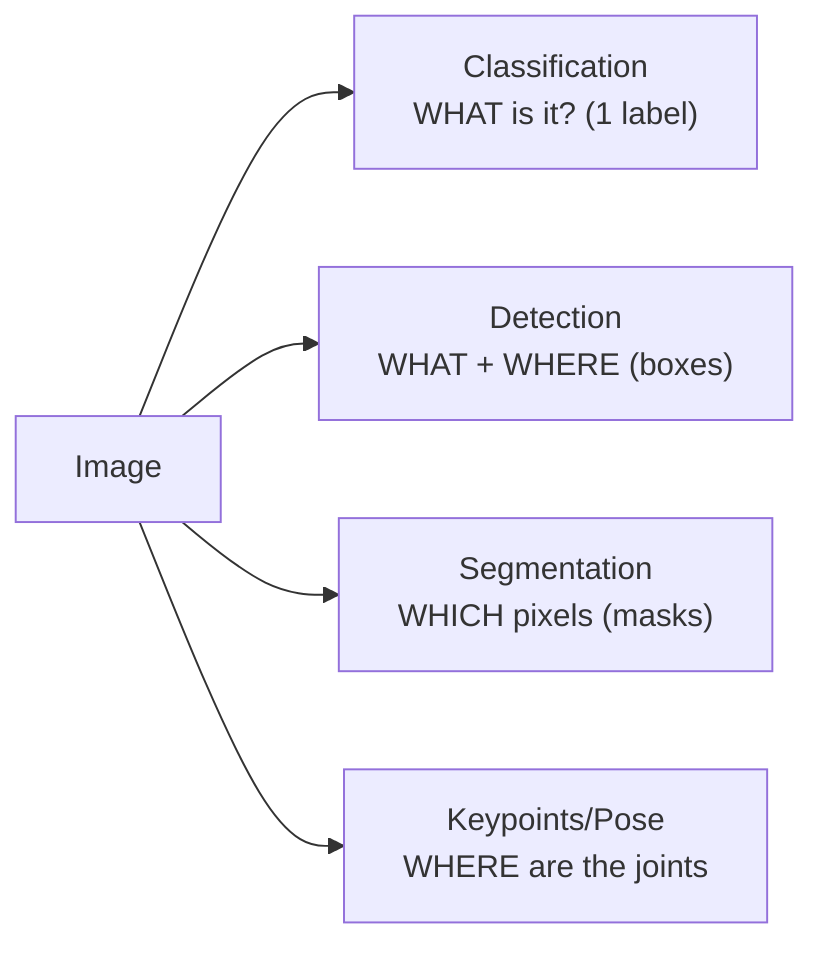
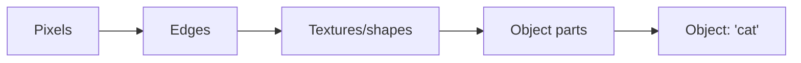

# 📝 Detailed Notes — Computer Vision

> Study notes distilled from the best free resources (see [Sources](#-sources-parsed)).
> Pair with the (ultralytics) [`example.py`](./example.py).

---

## 🎯 Easiest explanation (ELI5)

To a computer, an image is just a **grid of numbers** (pixel brightness/color).
Computer vision teaches it to turn that grid into meaning: *"this is a cat,"*
*"there's a car at these coordinates."*

**Analogy:** How *you* recognize a friend — you don't check pixels, you notice
**patterns** (hair, shape, smile) built from smaller patterns (edges, textures).
A **CNN** does the same: early layers detect edges, deeper layers assemble them
into objects. It learns the hierarchy of patterns automatically.

---

## 🌍 Real-world examples

| Application | Task type |
|---|---|
| "Is there a defect on this part?" (factory QA) | Classification |
| "Where are the cars/people?" (self-driving) | Object detection |
| "Outline the tumor" (medical imaging) | Segmentation |
| "Track the ball across frames" (sports) | Detection + tracking |
| "Read text from this receipt" | OCR |

---

## 📊 Visual — vision tasks, from coarse to fine



How a CNN sees, layer by layer:



---

## 🧩 Core concepts (with code)

### 1. Images as tensors
An image is `Height × Width × Channels` (RGB = 3). Normalize pixel values and
**augment** (flip/crop/rotate) to teach invariance and prevent overfitting.

### 2. CNNs — the workhorse
- **Convolution:** slide small filters over the image to detect local patterns.
- **Pooling:** downsample to keep the signal, shrink the size.
- **Feature maps:** stacked filters → increasingly abstract features.

### 3. Transfer learning (do this, don't train from scratch)
Start from a model pretrained on millions of images (ResNet, EfficientNet, ViT)
and fine-tune on your (smaller) dataset.

### 4. Modern detection in a few lines (YOLO)
```python
from ultralytics import YOLO
model = YOLO("yolov8n.pt")              # pretrained, real-time
results = model("street.jpg")
for box in results[0].boxes:
    print(model.names[int(box.cls)], float(box.conf))   # e.g. "car" 0.92
# Fine-tune on your data: model.train(data="data.yaml", epochs=50)
```

### 5. Architectures & evaluation
- **CNNs** (ResNet/EfficientNet), **Vision Transformers (ViT)**, **YOLO** (real-time
  detection), **SAM** (segment anything).
- Metrics: accuracy/top-k (classification), **mAP/IoU** (detection/segmentation).

---

## ⚠️ Common pitfalls & interview gotchas

- **Training from scratch** when transfer learning would do — wastes data/compute.
- **No / weak augmentation** → overfitting to your small dataset.
- **Train/serve preprocessing mismatch** (resize, normalization) — silent accuracy loss.
- **Class imbalance & tiny objects** hurt detection mAP.
- **Label quality** — detection is only as good as the bounding boxes you trained on.
- **Evaluating on data too similar to train** (leakage via near-duplicate frames).

---

## 🗺️ How it connects
CV applies **deep learning** (topic 05). Multimodal models now blend it with
**LLMs** (topic 11) for image understanding and captioning.

---

## 📚 Sources parsed

- **Krish Naik — Deep Learning playlist** (CNN sections): https://www.youtube.com/playlist?list=PLZoTAELRMXVPGU70ZGsckrMdr0FteeRUi
- **Stanford CS231n — Deep Learning for Computer Vision**: https://cs231n.stanford.edu/
- **Ultralytics YOLO docs**: https://docs.ultralytics.com/ · repo: https://github.com/ultralytics/ultralytics
- **PyImageSearch** (practical tutorials): https://pyimagesearch.com/
- **Roboflow** (labeling + tutorials): https://roboflow.com/
- **fast.ai** (applied vision): https://course.fast.ai/

> *Notes are paraphrased syntheses written for this guide; refer to the linked
> originals for authoritative detail. Content was rephrased for compliance with
> licensing restrictions.*
