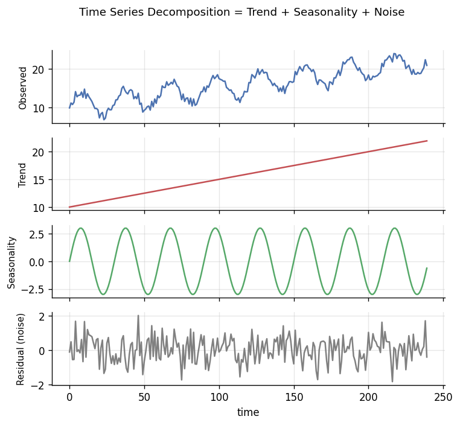

# 📝 Detailed Notes — Time Series & Forecasting

> Study notes distilled from the best free resources (see [Sources](#-sources-parsed)).
> Pair with the runnable [`example.py`](./example.py).

---

## 🎯 Easiest explanation (ELI5)

Time series data is **measurements in time order** (daily sales, hourly traffic,
heartbeats). Forecasting is **using the past to predict the future** — but the
catch is that today depends on yesterday, so you can't shuffle the data like
normal ML.

**Analogy:** Predicting tomorrow's weather. You look at **recent days** (trend),
the **season** (it's winter), and known **patterns** (cold fronts). You'd never
"shuffle" days from random years together — order and recency carry the signal.

---

## 🌍 Real-world examples

| Forecast | Drives the decision |
|---|---|
| Product demand | How much inventory to stock |
| Call/website traffic | Staffing & autoscaling |
| Revenue | Budgeting & targets |
| Energy load | Grid capacity planning |
| Sensor readings | Predictive maintenance / anomaly alerts |

---

## 📊 Visual — decomposition (the mental model)

Any series ≈ **Trend + Seasonality + Noise**. Separating them is how you
understand and forecast it.



---

## 🧩 Core concepts (with code)

### 1. Components & stationarity
- **Trend** (long-term direction), **seasonality** (repeating cycles),
  **residual** (noise).
- Many classic models need **stationarity** (stable mean/variance) → achieved by
  **differencing**. Check with the ADF test; inspect **ACF/PACF** plots.

### 2. The model families
- **Classical:** moving average, exponential smoothing (ETS), **ARIMA/SARIMA**.
- **ML approach:** build **lag & rolling features**, then use gradient boosting —
  flexible and often very strong.
- **Deep learning:** LSTM, N-BEATS, Temporal Fusion Transformer.
- **Foundation models:** TimeGPT, Chronos, TimesFM (zero-shot forecasting).

### 3. The non-negotiable: correct validation
Never shuffle time. Use **rolling-origin / forward-chaining** backtests, and
build features only from the **past**:
```python
df["lag_7"]  = series.shift(7)               # value a week ago (past only)
df["roll7"]  = series.shift(1).rolling(7).mean()  # shift(1) FIRST = no leak
```

### 4. Forecast intervals, not just points
Decisions need uncertainty. Report prediction intervals (e.g., 80/95%), not a
single line. Most modern libraries (statsforecast, Darts) give these directly.

---

## ⚠️ Common pitfalls & interview gotchas

- **Random train/test split** on time data → massive leakage and fantasy scores.
- **Leaky features** — rolling stats computed over the whole series (including
  the future). Always `shift` before rolling.
- **Ignoring seasonality/holidays** — big errors around peaks.
- **Point forecasts only** — no uncertainty for the business to plan around.
- **Not comparing to a naive baseline** (last value / seasonal naive) — fancy
  models often barely beat it.
- **Concept drift / regime change** (e.g., COVID) breaks models trained on the past.

---

## 🗺️ How it connects
Time series blends **stats** (topic 03) and **ML/DL** (04/05), and shares
monitoring concerns with **MLOps** (topic 09, drift detection).

---

## 📚 Sources parsed

- **Krish Naik — Time Series** content (ARIMA/LSTM) in the Grand Complete Materials: https://github.com/krishnaik06/The-Grand-Complete-Data-Science-Materials
- **Forecasting: Principles and Practice (FPP3)** — Hyndman & Athanasopoulos (free, definitive): https://otexts.com/fpp3/
- **Nixtla** (statsforecast / mlforecast / neuralforecast / TimeGPT): https://github.com/Nixtla
- **Darts** (unit8): https://unit8co.github.io/darts/ · **Prophet** (Meta): https://facebook.github.io/prophet/
- **sktime**: https://www.sktime.net/

> *Notes are paraphrased syntheses written for this guide; refer to the linked
> originals for authoritative detail. Content was rephrased for compliance with
> licensing restrictions.*
