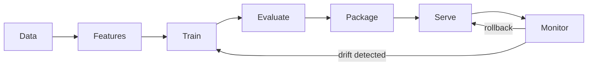
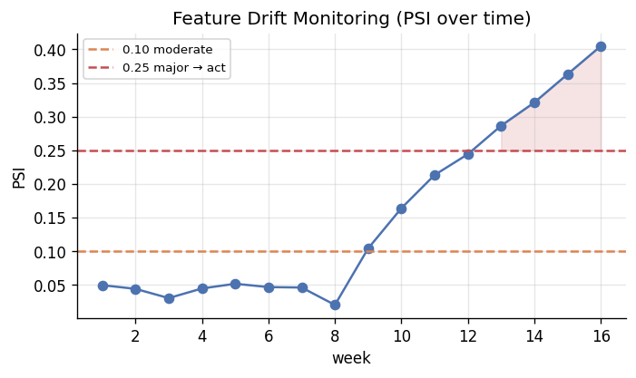

# 📝 Detailed Notes — MLOps & Production ML

> Study notes distilled from the best free resources (see [Sources](#-sources-parsed)).
> Pair with the runnable [`example.py`](./example.py).

---

## 🎯 Easiest explanation (ELI5)

MLOps is **everything needed to keep a model working in the real world** — not
just training it once in a notebook, but deploying it, watching it, and updating
it as the world changes.

**Analogy:** Training a model is like **cooking a great dish once.** MLOps is
running a **restaurant**: consistent recipes (versioning), a kitchen that serves
hundreds of orders reliably (deployment), health inspections (monitoring), and
updating the menu as tastes change (retraining). A brilliant dish nobody can
re-cook or serve at scale is worthless.

**Core truth:** *the model is ~5% of a real ML system* — the other 95% is data,
serving, monitoring, and plumbing.

---

## 🌍 Real-world examples

| Problem MLOps solves | Without it |
|---|---|
| "Which model is in prod & how was it trained?" | Nobody knows; can't reproduce |
| "Accuracy quietly dropped last month" | You find out from angry users |
| "Roll back the bad model now" | Hours of scramble |
| "Retrain weekly, automatically" | Manual, error-prone, forgotten |

---

## 📊 Visuals

The ML lifecycle is a **loop**, not a line:



**Monitoring for drift** (here PSI) is how you catch trouble *before* users do:



---

## 🧩 Core concepts (with code)

### 1. Experiment tracking & model registry
Log params, metrics, data version, and artifacts for **every** run; promote the
best to a registry with stages (staging → production) and instant rollback.
```python
import mlflow
with mlflow.start_run():
    mlflow.log_params(params)
    mlflow.log_metric("cv_auc", auc)
    mlflow.sklearn.log_model(model, "model")   # versioned artifact
```

### 2. Serving patterns
- **Batch / offline:** scheduled scoring (churn nightly). Simplest; often right.
- **Online / real-time:** API (FastAPI/BentoML) per request. Watch **latency**
  and the **feature computation path**.

### 3. Training/serving skew (the #1 production failure)
Features computed differently in training (batch SQL) vs serving (live code).
Fix with shared feature logic / a **feature store**, and log live features.

### 4. Monitoring — three layers
1. **Operational** — latency, errors, throughput.
2. **Data quality** — schema, nulls, ranges, volume.
3. **Model quality** — prediction/feature **drift** now; accuracy when labels arrive.

> **Covariate shift** (inputs move, visible in PSI) vs **concept drift** (X→y
> rule changes — often invisible in inputs; the dangerous one).

### 5. CI/CD for ML & retraining
Test code **and** data + an **eval gate** before promoting. Decide retraining
trigger (scheduled / performance / drift) and always have a **rollback plan**.

---

## ⚠️ Common pitfalls & interview gotchas

- **"It works in my notebook"** — not reproducible; pin deps, version data.
- **No monitoring** — silent decay; you learn from churn, not dashboards.
- **Confusing covariate shift vs concept drift** — classic interview question.
- **Auto-deploying without an eval gate** — ships regressions.
- **Ignoring training/serving skew** — great offline, broken live.
- **Over-engineering** — batch scoring often beats a real-time service; pick the
  simplest design that meets the SLA.

---

## 🗺️ How it connects
MLOps operationalizes **ML/DL** (topics 04/05) and **LLMs** (11), leans on **data
engineering** (10) for pipelines, and shares drift concepts with **time series** (08).

---

## 📚 Sources parsed

- **Krish Naik — MLOps**: Docker one-shot https://www.youtube.com/watch?v=8vmKtS8W7IQ · MLflow end-to-end https://www.youtube.com/watch?v=pxk1Fr33-L4 · Evidently monitoring https://www.youtube.com/watch?v=cgc3dSEAel0
- **Made With ML** — Goku Mohandas (free end-to-end MLOps): https://github.com/GokuMohandas/Made-With-ML
- **MLOps Zoomcamp** — DataTalksClub (free): https://github.com/DataTalksClub/mlops-zoomcamp
- **Designing ML Systems** — Chip Huyen: https://github.com/chiphuyen/dmls-book
- **awesome-mlops**: https://github.com/kelvins/awesome-mlops · **MLflow**: https://mlflow.org/ · **Evidently**: https://github.com/evidentlyai/evidently

> *Notes are paraphrased syntheses written for this guide; refer to the linked
> originals for authoritative detail. Content was rephrased for compliance with
> licensing restrictions.*
