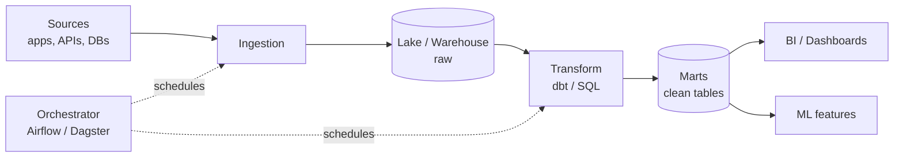

# 📝 Detailed Notes — Data Engineering for Data Scientists

> Study notes distilled from the best free resources (see [Sources](#-sources-parsed)).
> Pair with the runnable (DuckDB) [`example.py`](./example.py).

---

## 🎯 Easiest explanation (ELI5)

Data engineering is **building the pipes** that move data from where it's created
to where it's useful — clean, on time, and trustworthy. Data scientists drink
from these pipes; if the water's dirty, no model can save you.

**Analogy:** A **city water system.** Raw water (source data) is collected,
**filtered and treated** (cleaned/transformed), stored in **reservoirs**
(warehouse/lake), and piped on a **schedule** (orchestration) to homes
(dashboards & models). Data engineering is the plumbing, treatment, and
scheduling that makes clean water arrive reliably.

---

## 🌍 Real-world examples

| Need | Data engineering provides |
|---|---|
| Daily dashboard of fresh KPIs | Scheduled ELT pipeline (Airflow + dbt) |
| Model features computed nightly | Batch transformation job → feature table |
| 5TB of logs to analyze | Spark / partitioned Parquet in a lake |
| "Why did this number change?" | Versioned, tested, documented transforms |

---

## 📊 Visual — the modern data stack



Layered modeling: **bronze (raw) → silver (cleaned) → gold (business-ready).**

---

## 🧩 Core concepts (with code)

### 1. Storage & ELT
- **Warehouse** (Snowflake/BigQuery) vs **Lake** (object store + Parquet) vs
  **Lakehouse** (Delta/Iceberg).
- **ELT > ETL** in modern stacks: load raw, transform in-warehouse with SQL.

### 2. Transformation (dbt)
Version-controlled, **tested**, documented SQL. Treat data transforms like
software (PRs, tests, CI).

### 3. Orchestration
**Airflow / Dagster / Prefect** schedule DAGs (ingest → transform → score →
publish). Know **idempotency**, **backfills**, retries, dependencies.

### 4. The local superpowers (DuckDB / Polars)
Warehouse-style SQL on local files — no server:
```python
import duckdb
duckdb.sql("""
  SELECT region, SUM(amount) AS revenue
  FROM 'orders.parquet'
  GROUP BY region ORDER BY revenue DESC
""").df()
```

### 5. Data quality & contracts
Validate schema/ranges/freshness (**pandera**, Great Expectations, dbt tests).
**Data contracts** with upstream producers stop silent breakage.

### 6. Big data & streaming (awareness)
**Spark/PySpark** when data exceeds one machine (mind shuffles). **Kafka/Flink**
for real-time. But most "big data" fits in DuckDB — don't reach for a cluster
to process 2 GB.

---

## ⚠️ Common pitfalls & interview gotchas

- **Reaching for Spark too early** — overkill for data that fits in memory/DuckDB.
- **No data validation** — bad upstream data silently corrupts models.
- **Non-idempotent pipelines** — re-runs duplicate or corrupt data.
- **ETL spaghetti** — untested, undocumented SQL nobody can change safely.
- **Ignoring late-arriving / out-of-order data** in scheduled jobs.
- **Join fan-out** inflating metrics (also a SQL gotcha, topic 02).

---

## 🗺️ How it connects
Data engineering feeds **everything**: clean tables for **SQL/EDA** (02/01),
features for **ML** (04), and the pipelines that **MLOps** (09) schedules and
monitors.

---

## 📚 Sources parsed

- **Krish Naik — PySpark playlist**: https://www.youtube.com/playlist?list=PLZoTAELRMXVNjiiawhzZ0afHcPvC8jpcg
- **Data Engineering Zoomcamp** — DataTalksClub (free, end-to-end): https://github.com/DataTalksClub/data-engineering-zoomcamp
- **Fundamentals of Data Engineering** — Reis & Housley (the conceptual map).
- **dbt Learn** (free): https://learn.getdbt.com/ · **awesome-data-engineering**: https://github.com/igorbarinov/awesome-data-engineering
- **DuckDB**: https://duckdb.org/ · **Polars**: https://pola.rs/ · **Airflow**: https://airflow.apache.org/

> *Notes are paraphrased syntheses written for this guide; refer to the linked
> originals for authoritative detail. Content was rephrased for compliance with
> licensing restrictions.*
