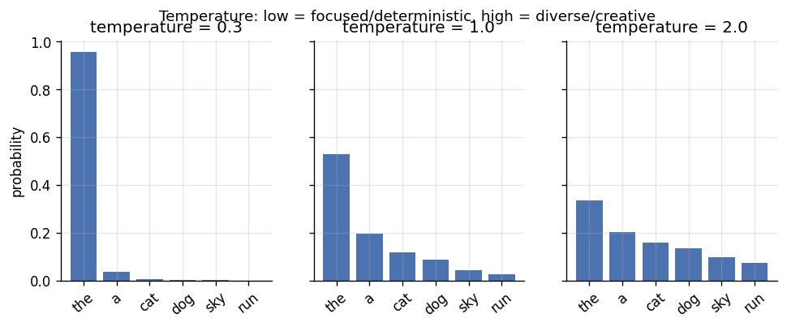
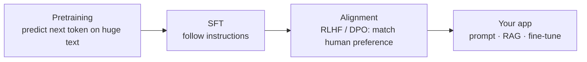
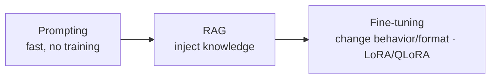

# 📝 Detailed Notes — Large Language Models (LLMs)

> Study notes distilled from the best free resources (see [Sources](#-sources-parsed)).
> Pair with the runnable (mock) [`example.py`](./example.py).

---

## 🎯 Easiest explanation (ELI5)

An LLM is a **gigantic autocomplete.** Trained on huge amounts of text, it learns
to predict the **next word** (token) over and over — and doing that *extremely
well* turns out to look like reasoning, writing, and answering questions.

**Analogy:** Imagine someone who has read most of the internet and plays a game:
you give them the start of a sentence, they guess the most likely next word, add
it, and repeat. That's literally how an LLM writes — one token at a time, each
choice informed by everything before it.

**Key truth:** it predicts what's *plausible*, not what's *true* — which is why it
can **hallucinate** confidently. Everything in GenAI engineering is about
steering and grounding that autocomplete.

---

## 🌍 Real-world examples

| Use case | How the LLM is used |
|---|---|
| Support assistant | Summarize tickets, draft replies, classify intent |
| Knowledge Q&A | Answer from company docs (RAG, topic 12) |
| Data extraction | Messy text → structured JSON fields |
| Coding copilot | Generate / refactor / explain code |
| Analytics | Natural language → SQL |

---

## 📊 Visual — temperature controls randomness

The same model can be **focused/deterministic** (low temperature) or
**creative/diverse** (high temperature). It reshapes the next-token probability
distribution.





---

## 🧩 Core concepts (with code)

### 1. Tokens, context window, inference controls
- **Tokens** (word-pieces) drive **cost** and the **context window** (working memory).
- **Temperature / top-p:** randomness. **Max tokens:** output length. Use
  `temperature=0` for deterministic extraction.

### 2. How to adapt a model (cheapest → most effort)

- **Prompting/few-shot** — first thing to try.
- **RAG** — when you need *fresh/private knowledge* (topic 12).
- **Fine-tuning (LoRA/QLoRA)** — when you need *behavior/format/style*; cheap
  adapter training on one GPU.

### 3. Structured output (production-safe)
Never parse free text for programmatic use — request JSON and validate:
```python
resp = client.chat.completions.create(
    model="gpt-4o-mini",
    messages=[...],
    response_format={"type": "json_object"},   # force valid JSON
    temperature=0)
```

### 4. Evaluation (the make-or-break skill)
Build a **fixed eval set** + a **regression suite** run on every prompt/model
change. Use task metrics + **LLM-as-judge** (validated against humans).

### 5. Serving concerns
Latency (streaming, smaller models, caching), cost (token budgets, routing),
reliability (retries, fallbacks, output validation), safety (prompt injection, PII).

---

## ⚠️ Common pitfalls & interview gotchas

- **Treating output as truth** — hallucination is inherent; ground (RAG) + verify.
- **Parsing free text** instead of structured output → brittle pipelines.
- **No eval harness** — prompt tweaks silently regress quality.
- **Ignoring token cost/latency** — costs explode at scale; cache and trim context.
- **Prompt injection** — untrusted text (user or retrieved) hijacks the model.
- **Fine-tuning when prompting+RAG would do** — expensive and often unnecessary.

---

## 🗺️ How it connects
LLMs build on **transformers** (topics 05/06). They're operated via **prompting**
(13), grounded with **RAG** (12), made agentic with **tools** (14), and shipped
with **MLOps** discipline (09).

---

## 📚 Sources parsed

- **Krish Naik — GenAI/OpenAI playlist**: https://www.youtube.com/playlist?list=PLZoTAELRMXVMTWGW9iS45ZTcMsntos6VO · **LangChain playlist**: https://www.youtube.com/playlist?list=PLZoTAELRMXVORE4VF7WQ_fAl0L1Gljtar
- **mlabonne/llm-course** (best free structured curriculum): https://github.com/mlabonne/llm-course
- **Hugging Face — LLM Course**: https://huggingface.co/learn/llm-course
- **Andrej Karpathy — "Let's build GPT" / Intro to LLMs** (YouTube).
- **Lilian Weng's blog** (deep dives): https://lilianweng.github.io/ · **Chip Huyen**: https://huyenchip.com/blog/

> *Notes are paraphrased syntheses written for this guide; refer to the linked
> originals for authoritative detail. Content was rephrased for compliance with
> licensing restrictions.*
