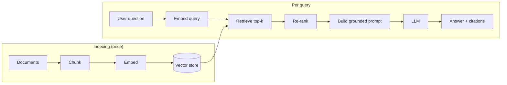
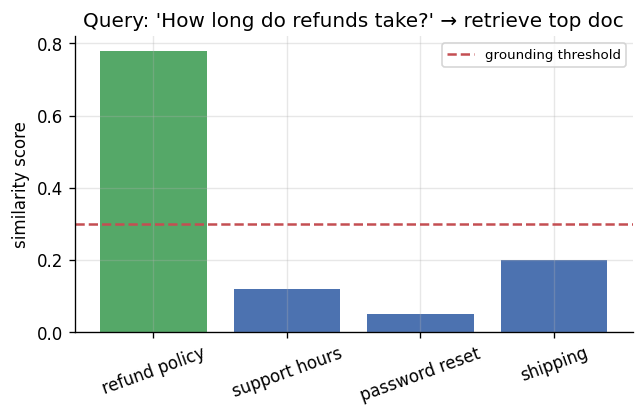

# 📝 Detailed Notes — RAG (Retrieval-Augmented Generation)

> Study notes distilled from the best free resources, incl. the excellent
> **RAG Zero-to-Hero** guide (see [Sources](#-sources-parsed)). Pair with the
> runnable [`example.py`](./example.py).

---

## 🎯 Easiest explanation (ELI5)

An LLM only knows what it saw during training — not your company's private docs,
and nothing new since its cutoff. RAG fixes this by **looking things up first,
then answering** using what it found.

**Analogy:** An **open-book exam.** Instead of forcing the student (LLM) to recall
everything from memory (and risk making things up), you let them **search the
textbook** for the relevant pages, then write the answer **based on those pages**
— and cite them. Better accuracy, fewer hallucinations, and the "book" can be
updated any time.

---

## 🌍 Real-world examples

| Application | The "book" being searched |
|---|---|
| Customer support bot | Help center articles |
| Internal "ask the wiki" | Confluence / Notion / Google Docs |
| Code assistant | Your repository |
| Legal / research Q&A | Contracts, filings, papers (with citations) |
| Product assistant | Manuals, specs, FAQs |

---

## 📊 Visual — the RAG pipeline



Retrieval scores decide everything — ground when the top match is strong,
**abstain** when it's weak (avoids hallucination):



---

## 🧩 Core concepts (with code)

### The 4 stages (RAG Zero-to-Hero framing)
**Indexing → Retrieval → Augmentation → Generation.**

### 1. Chunking
Split docs into passages on **semantic boundaries**; tune size & overlap. Too big
= noisy context; too small = lost meaning.

### 2. Embeddings + vector store
Turn chunks into vectors; store in FAISS / Chroma / pgvector / Qdrant / Pinecone.

### 3. Retrieval (dense + lexical = hybrid)
```python
from sklearn.feature_extraction.text import TfidfVectorizer
from sklearn.metrics.pairwise import cosine_similarity
# (toy) production: dense embeddings + BM25 (hybrid usually wins) + a reranker
vec = TfidfVectorizer().fit(docs); D = vec.transform(docs)
sims = cosine_similarity(vec.transform([query]), D)[0]
top = sims.argsort()[::-1][:3]
```
Add a **cross-encoder re-ranker** over top-k for a big precision boost.

### 4. Augmentation + generation
Build a prompt with the retrieved context + **citation instructions**, then
generate. Always include an **"if not in context, say you don't know"** rule.

### 5. Evaluation (most teams skip this — don't)
- **Retriever metrics:** hit-rate@k, MRR, recall@k, context precision.
- **Generator metrics:** faithfulness/groundedness, answer relevance.
- Tools: **RAGAS**, **DeepEval**; detect hallucination explicitly.

---

## ⚠️ Common pitfalls & interview gotchas

- **Blaming the LLM when retrieval is the problem.** Diagnose: bad answer →
  check if the right chunk was even retrieved.
- **No evaluation** → you can't improve chunking/embeddings/k objectively.
- **Pure vector search** — add lexical (BM25) hybrid + reranking.
- **Stuffing too much context** — raises cost/latency and dilutes the answer.
- **No abstention** — model invents answers for out-of-scope questions.
- **Prompt injection via retrieved content** — treat documents as untrusted.

---

## 🗺️ How it connects
RAG = **NLP embeddings** (topic 06) + **LLMs** (11) + **prompting** (13). Add
tools and it becomes **agentic RAG** (topic 14). Build from scratch in
`data-science-training/hands-on/lab05`.

---

## 📚 Sources parsed

- **RAG Zero-to-Hero Guide** — Kalyan KS (NLP): https://github.com/KalyanKS-NLP/rag-zero-to-hero-guide (Indexing→Retrieval→Augmentation→Generation; eval metrics; RAGAS/DeepEval; hallucination detection).
- **Krish Naik — LangChain playlist**: https://www.youtube.com/playlist?list=PLZoTAELRMXVORE4VF7WQ_fAl0L1Gljtar
- **awesome-rag**: https://github.com/coree/awesome-rag · **RAGAS**: https://github.com/explodinggradients/ragas
- **LangChain RAG tutorial**: https://python.langchain.com/docs/tutorials/rag/ · **LlamaIndex**: https://docs.llamaindex.ai/

> *Notes are paraphrased syntheses written for this guide; refer to the linked
> originals for authoritative detail. Content was rephrased for compliance with
> licensing restrictions.*
