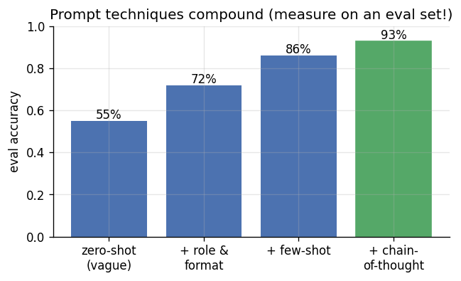
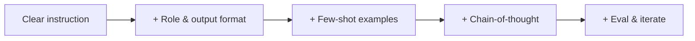

# 📝 Detailed Notes — Prompt Engineering

> Study notes distilled from the best free resources (see [Sources](#-sources-parsed)).
> Pair with the runnable [`example.py`](./example.py).

---

## 🎯 Easiest explanation (ELI5)

A prompt is your **instruction to the model.** Prompt engineering is learning to
give instructions so clear and well-structured that you reliably get what you
want — every time, not just sometimes.

**Analogy:** Delegating to a brilliant but *very literal* new intern who has no
context about your company. Say "write something about our product" and you get
something generic. Say "You are our product analyst. In 3 bullet points, for an
executive, summarize the top complaints in this review, and return JSON" — and
you get exactly what you need. **Specificity + structure + examples = quality.**

---

## 🌍 Real-world examples

| Goal | Prompt technique |
|---|---|
| Extract fields from text | Strict JSON schema + `temperature=0` |
| Solve a multi-step problem | Chain-of-thought ("think step by step") |
| Match a tone/format | Few-shot examples |
| Route a request | Classify-then-act decomposition |
| Reliable automation | Structured output + validation + retry |

---

## 📊 Visual — techniques compound

Each technique adds reliability. Measure it on an eval set instead of guessing.





---

## 🧩 Core concepts (with code)

### 1. The anatomy of a strong prompt
- **Role / system:** persona + rules + boundaries.
- **Task:** what to do, specifically.
- **Format:** exact output shape (JSON schema for anything programmatic).
- **Examples (few-shot):** show input→output.
- **Constraints:** length, tone, "only use the context," "say I don't know if unsure."

### 2. Core techniques
- **Zero-shot** (just ask) → **few-shot** (show examples) → **chain-of-thought**
  (step-by-step reasoning for hard tasks).
- **Decomposition:** break a big task into a chain of smaller prompts.
- **Structured output / function calling:** for reliable, parseable results.

### 3. Context engineering
What you put *in* the window (retrieved docs, history, tools) often matters more
than clever wording. Order matters; trim irrelevant content.

### 4. Prompts are code
Version them, build an **eval set**, and run it on every change:
```python
def evaluate(prompt):
    return sum(call_llm(prompt, x) == gold for x, gold in EVAL_SET) / len(EVAL_SET)
```

---

## ⚠️ Common pitfalls & interview gotchas

- **Vague prompts** → vague output. Be explicit about format and constraints.
- **No examples** for format-sensitive tasks — few-shot fixes most issues.
- **Free-text output** you then regex-parse — request JSON instead.
- **No evaluation** — "it looks better" isn't measurement; use an eval set.
- **Prompt injection** — untrusted user/retrieved text overrides your instructions;
  isolate, validate, and constrain tool permissions.
- **Over-long prompts** — cost/latency up, focus down; keep context tight.

---

## 🗺️ How it connects
Prompting is the primary interface to **LLMs** (topic 11), the "augmentation" step
in **RAG** (12), and the reasoning layer of **agents** (14).

---

## 📚 Sources parsed

- **dair-ai — Prompt Engineering Guide** (the comprehensive open guide): https://github.com/dair-ai/Prompt-Engineering-Guide
- **Anthropic — Interactive Prompt Engineering Tutorial**: https://github.com/anthropics/prompt-eng-interactive-tutorial · **best practices**: https://docs.anthropic.com/en/docs/build-with-claude/prompt-engineering/overview
- **OpenAI — Prompt engineering guide**: https://platform.openai.com/docs/guides/prompt-engineering
- **Krish Naik — GenAI/LangChain playlists** (prompting in practice): https://www.youtube.com/@krishnaik06
- **DeepLearning.AI — ChatGPT Prompt Engineering for Developers** (free).

> *Notes are paraphrased syntheses written for this guide; refer to the linked
> originals for authoritative detail. Content was rephrased for compliance with
> licensing restrictions.*
