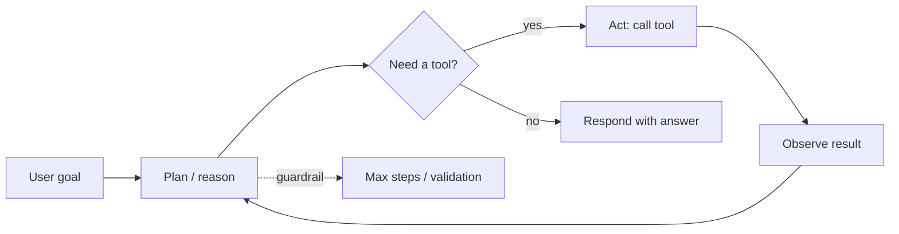

# 📝 Detailed Notes — AI Agents

> Study notes distilled from the best free resources (see [Sources](#-sources-parsed)).
> Pair with the runnable (mock) [`example.py`](./example.py).

---

## 🎯 Easiest explanation (ELI5)

A normal LLM only **talks**. An agent can **act** — it decides to use **tools**
(search the web, call an API, run code, query a database), looks at the result,
and keeps going until the task is done.

**Analogy:** A chatbot is a person answering from memory in a locked room. An
**agent** is that same person with a **phone, a calculator, and internet access**
— they can look things up, do calculations, take actions, and check their work
before answering. The LLM is the *brain*; tools are the *hands*.

> ⚠️ Reality check: many "agents" are just automation with a label. A real agent
> **reasons, chooses tools, and completes multi-step tasks** — not a fixed script.

---

## 🌍 Real-world examples

| Agent | Tools it uses |
|---|---|
| Research assistant | web search → read → synthesize → cite |
| Customer-ops agent | look up order → issue refund → update ticket |
| Data analyst copilot | write SQL → run it → interpret results |
| Coding agent | read repo → edit files → run tests |
| Multi-agent "crew" | researcher + writer + reviewer collaborate |

---

## 📊 Visual — the agent loop (ReAct)



The cycle — **plan → act → observe → repeat** — continues until the goal is met
or a guardrail (max steps) stops it.

---

## 🧩 Core concepts (with code)

### 1. Tool / function calling (the foundation)
The model returns a structured request to call a function; your code runs it and
feeds the result back.
```python
# 1) LLM decides: call get_weather(city="Dubai")
# 2) your code runs the REAL tool -> "38C sunny"
# 3) LLM uses the observation to answer
```

### 2. The agent loop & memory
- **ReAct:** interleave reasoning and acting.
- **Memory:** short-term (context window) + long-term (vector store / state).

### 3. Frameworks
- **LangGraph** — graph of states/tools/evaluators; robust, production-leaning.
- **CrewAI** — role-based multi-agent crews (researcher → writer → reviewer).
- **AutoGen**, **OpenAI Agents SDK**, **LlamaIndex agents**.

### 4. Guardrails (essential — agents fail in new ways)
- **Bounded loops** (max steps), **validated tool I/O**, **timeouts**, **fallbacks**.
- Constrain tool permissions; never let an agent take high-privilege actions
  unchecked.

### 5. Evaluation & observability
Trace every step (prompt, tool call, observation). Evaluate **task success**, not
vibes; watch cost and latency (agents multiply both).

---

## ⚠️ Common pitfalls & interview gotchas

- **No step limit** → infinite loops / runaway cost. Always bound the loop.
- **Unvalidated tool inputs/outputs** → cascading errors; validate at each hop.
- **Over-agentifying** — if a single prompt or RAG call suffices, don't build a
  multi-agent system. Simplicity wins.
- **Prompt injection through tools/retrieved data** — the agent can be hijacked
  into harmful actions; sandbox and restrict permissions.
- **No observability** — you can't debug what you can't trace.
- **Latency/cost blowup** — each step is an LLM call; cache and constrain.

---

## 🗺️ How it connects
Agents = **LLMs** (topic 11) + **tool calling** + **prompting** (13), often with
**RAG** (12) as one tool ("agentic RAG"). Productionizing them needs **MLOps**
discipline (09).

---

## 📚 Sources parsed

- **Krish Naik — Agentic AI / LangGraph / CrewAI** tutorials: https://www.youtube.com/@krishnaik06
- **Hugging Face — AI Agents Course** (free): https://huggingface.co/learn/agents-course
- **DeepLearning.AI — agent short courses** (LangGraph, CrewAI, AutoGen): https://www.deeplearning.ai/short-courses/
- **LangGraph docs**: https://langchain-ai.github.io/langgraph/ · **CrewAI examples**: https://github.com/crewAIInc/crewAI-examples
- **dair-ai Prompt Engineering Guide** (agents section): https://github.com/dair-ai/Prompt-Engineering-Guide

> *Notes are paraphrased syntheses written for this guide; refer to the linked
> originals for authoritative detail. Content was rephrased for compliance with
> licensing restrictions.*
