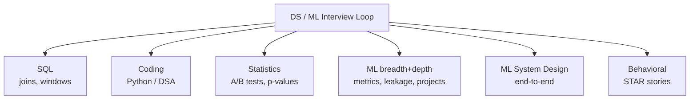

# 📝 Detailed Notes — Data Science Interview Prep

> Study notes distilled from the best free resources (see [Sources](#-sources-parsed)).
> Pair with the runnable [`example.py`](./example.py).

---

## 🎯 Easiest explanation (ELI5)

A DS interview tests **breadth + judgment under pressure**, not just whether you
can build a model. It samples your SQL, stats, ML, coding, system design, and
communication — quickly — to predict how you'll perform on the job.

**Analogy:** A **driving test.** You already drive daily (do the job), but the
examiner checks specific maneuvers on demand — parallel park (SQL window
function), emergency stop (debug a leaky model), explain the rules (stats). You
pass by **practicing the exact maneuvers**, out loud, until they're automatic.

---

## 🌍 The rounds (what each tests)



| Round | They're checking |
|---|---|
| **SQL** | Can you self-serve data? (windows, joins, fan-out) |
| **Coding** | Clean Python, basic DSA, data manipulation |
| **Statistics** | Experiment design, p-value/CI literacy, no traps |
| **ML breadth** | Algorithms, metrics, leakage, "how would you approach X" |
| **ML depth** | Defend every choice in your past projects |
| **System design** | Frame + design a whole ML system (the senior signal) |
| **Behavioral** | Impact, collaboration, communication (STAR) |

---

## 🧩 Core concepts (with code)

### 1. SQL — the highest-ROI prep
Drill window functions and top-N-per-group daily (DataLemur):
```sql
SELECT department, name, salary FROM (
  SELECT *, DENSE_RANK() OVER (PARTITION BY department
                               ORDER BY salary DESC) rnk
  FROM employees
) t WHERE rnk <= 3;
```

### 2. Stats — explain simply + simulate
Be ready to explain p-values/CIs to a non-expert, and to **simulate** when unsure:
```python
import numpy as np
rng = np.random.default_rng(0)
# P(>=8 heads in 10 fair flips)?
print((rng.binomial(10, 0.5, 1_000_000) >= 8).mean())   # ~0.055
```

### 3. ML — defend your choices
For every project: why that metric? that CV scheme? how did you prevent leakage?
what was the baseline? what was the business impact?

### 4. System design — use a framework
Requirements → data → metrics → features → model → serving → monitoring →
failure modes. (See `data-science-training/modules/08-ml-system-design.md`.)

### 5. Behavioral — STAR
**S**ituation, **T**ask, **A**ction, **R**esult. Prepare 5–6 stories (impact,
conflict, failure, leadership) with quantified results.

---

## ⚠️ Common pitfalls & interview gotchas

- **Jumping to code/answer** before clarifying the question and stating assumptions.
- **Silent thinking** — interviewers score *reasoning*; think out loud.
- **p-value = P(hypothesis true)** — wrong; it's P(data | H₀). Don't fumble this.
- **No baseline** in ML answers; over-engineering in system design.
- **Vague behavioral answers** — no numbers, no "I" (vs "we").
- **Can't explain your own resume project** in depth — rehearse it.

---

## 🗺️ How it connects
Interview prep is a **diagnostic across the whole library** — weak rounds point
you back to topics 02 (SQL), 03 (stats), 04 (ML), and
`data-science-training/modules/08` (system design).

---

## 📚 Sources parsed

- **Krish Naik — interview prep & DS Gen-AI playlist** (interview + real projects): https://www.youtube.com/playlist?list=PLZoTAELRMXVMTWGW9iS45ZTcMsntos6VO · channel: https://www.youtube.com/@krishnaik06
- **Introduction to ML Interviews** — Chip Huyen (free): https://huyenchip.com/ml-interviews-book/
- **machine-learning-interview** — Khang Pham: https://github.com/khangich/machine-learning-interview
- **Data-Science-Interview-Resources** — rbhatia46: https://github.com/rbhatia46/Data-Science-Interview-Resources
- **DataLemur** (SQL/stats/ML practice): https://datalemur.com/ · **chiphuyen/ml-systems-design**: https://github.com/chiphuyen/machine-learning-systems-design

> *Notes are paraphrased syntheses written for this guide; refer to the linked
> originals for authoritative detail. Content was rephrased for compliance with
> licensing restrictions.*
