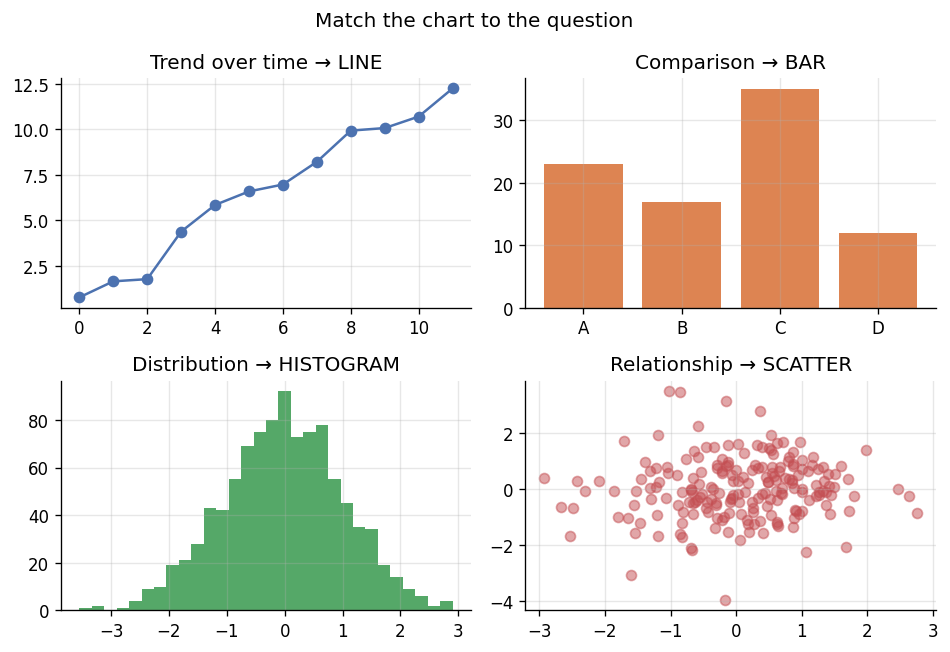
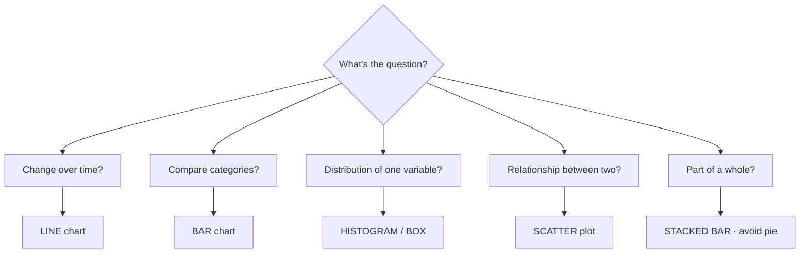

# 📝 Detailed Notes — Data Visualization & Storytelling

> Study notes distilled from the best free resources (see [Sources](#-sources-parsed)).
> Pair with the runnable [`example.py`](./example.py).

---

## 🎯 Easiest explanation (ELI5)

A chart's only job is to **make the answer obvious at a glance.** Numbers in a
table make people *work*; a good chart makes the insight *jump out*.

**Analogy:** A chart is a **sentence, not a paragraph.** Each chart should say
**one thing** clearly. If you need a paragraph to explain it, you've drawn the
wrong chart (or too many things on one).

---

## 🌍 Real-world examples

| Audience | What they need |
|---|---|
| Executive | One chart: the decision + the risk (e.g., "revenue is down 8% in EU") |
| Engineer | The mechanism / where the bottleneck is |
| Analyst | The method + distribution + uncertainty |
| You (EDA) | Quick-and-dirty: spot outliers, skew, relationships fast |

---

## 📊 Visual — match the chart to the question

The single most useful skill: pick the chart that fits the question.





---

## 🧩 Core concepts (with code)

### 1. Encoding hierarchy (how accurately people read channels)
Position > length > angle/area > color/shade. That's *why* bar charts beat pie
charts and dual-axis charts mislead — humans read position best.

### 2. One chart = one message; label the takeaway
```python
import seaborn as sns, matplotlib.pyplot as plt
ax = sns.barplot(data=tips, x="day", y="total_bill", errorbar=("ci", 95))
ax.set_title("Friday bills run ~70% higher than Monday")  # the MESSAGE, not "bill by day"
sns.despine()  # remove chart junk
```

### 3. Always show uncertainty
Point estimates lie by omission. Add error bars / confidence intervals so people
don't over-trust noise.

### 4. Storytelling (BLUF)
**B**ottom **L**ine **U**p **F**ront: lead with the conclusion, then support it.
Tailor framing to the audience (revenue/risk for execs, mechanism for engineers).

### 5. The toolbox
- **matplotlib** (foundation, full control), **seaborn** (statistical, pretty
  defaults), **Plotly/Altair** (interactive), **BI**: Tableau / Power BI / Metabase.

---

## ⚠️ Common pitfalls & interview gotchas

- **Pie charts** for >2-3 slices — humans can't compare angles. Use a bar.
- **Dual y-axes** — manufacture fake correlations; avoid.
- **Truncated y-axis** — exaggerates tiny differences (sometimes misleading).
- **Chart junk** — 3D, heavy gridlines, too many colors. Less ink = clearer.
- **No uncertainty** — showing a point estimate as if it's exact.
- **Rainbow colormaps** — perceptually misleading; use viridis/sequential.

---

## 🗺️ How it connects
Visualization is the **delivery layer** for everything: EDA (topic 01), stats
results (topic 03), model evaluation (topic 04), and stakeholder communication
(`data-science-training/modules/09`).

---

## 📚 Sources parsed

- **Krish Naik — EDA & visualization** content within the Grand Complete Materials: https://github.com/krishnaik06/The-Grand-Complete-Data-Science-Materials
- **Storytelling with Data** — Cole Nussbaumer Knaflic: https://www.storytellingwithdata.com/
- **Fundamentals of Data Visualization** — Claus Wilke (free): https://clauswilke.com/dataviz/
- **From Data to Viz** (chart chooser): https://www.data-to-viz.com/
- **seaborn**: https://seaborn.pydata.org/ · **matplotlib**: https://matplotlib.org/

> *Notes are paraphrased syntheses written for this guide; refer to the linked
> originals for authoritative detail. Content was rephrased for compliance with
> licensing restrictions.*
